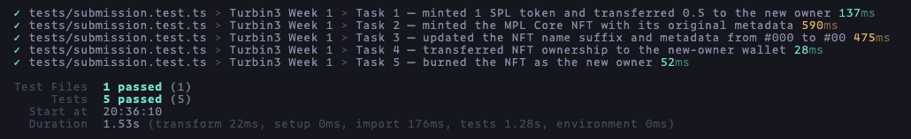

# Solana SPL Token and MPL Core NFT

TypeScript scripts for creating and managing an SPL token and an MPL Core NFT on Solana devnet.

## Overview

This project demonstrates two complete on-chain workflows:

- Create and initialize an SPL token mint, attach metadata, mint one token, and transfer half of it to another wallet.
- Upload an image and metadata to Irys, mint an MPL Core NFT, update its name and metadata, transfer it to another wallet, and burn it.

The scripts use [Solana Kit](https://www.solanakit.com/) and Metaplex Umi.

## Setup

### 1. Install dependencies

```bash
pnpm install --frozen-lockfile
```

### 2. Add the wallets

Place both devnet wallet keypair files in the project root:

```text
root/
├── devnet-wallet.json
└── new-owner-wallet.json
```

Each keypair is a JSON array of numbers, for example `[174, 23, ...]`.

### 3. Add the NFT image

Place the source image in the project root as `image.png`:

```text
root/
└── image.png
```

## Workflow commands

### SPL token

| Script            | Command             | Purpose                                                        |
| ----------------- | ------------------- | -------------------------------------------------------------- |
| `spl_init.ts`     | `pnpm spl:init`     | Create and initialize the token mint                           |
| `spl_metadata.ts` | `pnpm spl:metadata` | Attach the token name, symbol, and URI                         |
| `spl_mint.ts`     | `pnpm spl:mint`     | Create the owner's associated token account and mint the token |
| `spl_transfer.ts` | `pnpm spl:transfer` | Transfer half the token to the new owner's token account       |

### MPL Core NFT

| Script            | Command             | Purpose                                                      |
| ----------------- | ------------------- | ------------------------------------------------------------ |
| `nft_image.ts`    | `pnpm nft:image`    | Upload the NFT image to Irys                                 |
| `nft_metadata.ts` | `pnpm nft:metadata` | Build and upload the initial metadata JSON                   |
| `nft_mint.ts`     | `pnpm nft:mint`     | Mint the NFT using the initial metadata URI                  |
| `nft_update.ts`   | `pnpm nft:update`   | Change the NFT name and metadata from `#000` to `#00`        |
| `nft_transfer.ts` | `pnpm nft:transfer` | Transfer the NFT to the wallet in `new-owner-wallet.json`    |
| `nft_burn.ts`     | `pnpm nft:burn`     | Burn the NFT as the new owner and reclaim the available rent |

## Verification

Run the tests:

```bash
pnpm test
```



## Submission

### Completed tasks

- [x] Mint and transfer an SPL token
- [x] Mint an NFT with MPL Core
- [x] Update the NFT name and metadata
- [x] Transfer NFT ownership
- [x] Burn the NFT

### Artifacts

| Artifact                       | Value                                                                                  |
| ------------------------------ | -------------------------------------------------------------------------------------- |
| SPL token mint                 | `5w7HrxgaP962bm4ADxdpn77jPmcBiSaxW68TPTCWNLtu`                                         |
| Original owner's token account | `FHGpQBnJzaa1MayyUhyNpUgFXC7M6T8XjeL6H4ZAFFgZ`                                         |
| New owner's token account      | `5WRYFJuXdL7qCoeaPbSdwFzZQtq2w7pPUHjUhzHwmCaw`                                         |
| NFT asset                      | `FWXC16Huqhc3VUcKnFb8EoaZhUaNAbDhsA42NjWfWrJ6`                                         |
| Original owner                 | `1X4w38L9Hu84LF5b75YmoAZgFkPew32ppD6vEuaXJHq`                                          |
| New owner                      | `Be5dKMH4cQvzgc5iJnzyUFz4mNePKdvastHNgcFwfEg9`                                         |
| NFT image                      | [Irys image](https://gateway.irys.xyz/FxenccNqC58hSz6D2ajDFH1UJNQE4WmLZtHkag243p2v)    |
| Initial metadata (`#000`)      | [Irys metadata](https://gateway.irys.xyz/8MNLwLPT3szuDsj925G8gSZgFVZg3v4hY9dWA4K6qaBP) |
| Updated metadata (`#00`)       | [Irys metadata](https://gateway.irys.xyz/NZQJJzhLUYHjVyvHNU4ThxKJk8otVa3xeTcWhVkvFiS)  |

### Transactions

| Task | Operation               | Devnet transaction                                                                                                                                         |
| ---- | ----------------------- | ---------------------------------------------------------------------------------------------------------------------------------------------------------- |
| 1    | Create SPL mint         | [`2dprGBMD…QiK3v`](https://explorer.solana.com/tx/2dprGBMDy81kTpc5XkfUrSBCzrXsQPT3p2UAvfrwfPfWWfC6KZQqPh7yCRgjFe41RLjiCq6di4CEYpUHKwuQiK3v?cluster=devnet) |
| 1    | Create SPL metadata     | [`yv1fDoSU…EgwC9`](https://explorer.solana.com/tx/yv1fDoSUBsT9GowxNVHZhhVbN2C8C3oDx9bW7xVmxEfk55xHApHy5C9uVdpqVira2JpYcTmonp7yitsKzXEgwC9?cluster=devnet)  |
| 1    | Initial SPL mint        | [`Lihobwbh…EruP`](https://explorer.solana.com/tx/LihobwbhjGxmMpJXuSqmnhxqhKJkAthAzBng9KtqxqUm8DfsrsqNfoiy2jZxJS3Eqmq8RPXu1wyNzMzsMqdEruP?cluster=devnet)   |
| 1    | Complete SPL mint       | [`4U8E3uu3…RYpvq`](https://explorer.solana.com/tx/4U8E3uu3RMuMDuf7a67KuNprQhpZ8Bkirj5ovAiSZX3EZ85k49eV9VggZGvDf9NG4vGW9N9RyQiSaF9wQgaRYpvq?cluster=devnet) |
| 1    | Transfer 0.5 SPL token  | [`49sqxuG1…f5mrz`](https://explorer.solana.com/tx/49sqxuG1XKAevPUDCoxj7G4GpSNFiB7omikbqXypN4KSzHyJrFqDz6ifUAN1dG9hpYFCsb1GXgfzKCkBtaPf5mrz?cluster=devnet) |
| 2    | Mint MPL Core NFT       | [`mpTZ9Rk6…MTbxK`](https://explorer.solana.com/tx/mpTZ9Rk6RvzFYWX1nu9vu8EyXdEK7UwH5kXdUnwJpaqfCUEbx9g1dQLTgRKYCugG3DtH15uqPGehPhJM8rMTbxK?cluster=devnet)  |
| 3    | Update NFT and metadata | [`L2yZG9dE…VbYm9`](https://explorer.solana.com/tx/L2yZG9dEBAQYgJiL9YtXZXWmVZJdTG7ZNx9rGArDDAEGHrpbYSfxRY3kYW98pRJZY29MjBZUBLFEpDgAVNVbYm9?cluster=devnet)  |
| 4    | Transfer NFT            | [`29dxVunC…uWcjM`](https://explorer.solana.com/tx/29dxVunCc95yqkR6HS9DsL1xMt3gmDzrNBFX7vBKY8Lgz25m9u8wVe7ivpKvniKwC6TfGE84F5pEKJjK8ZBuWcjM?cluster=devnet) |
| 5    | Burn NFT                | [`3WJCXgss…8ghy`](https://explorer.solana.com/tx/3WJCXgssNrHoRTUwB2E6jcUHAtGJqEo8iVr2dMRwCXdePhGHB6Cn8xmk67thGF5Gnqxgf5i6av6rGTDLCqdt8ghy?cluster=devnet)  |

## References

- [Solana token documentation](https://solana.com/docs/tokens)
- [Solana Kit](https://www.solanakit.com/)
- [Metaplex Token Metadata](https://www.metaplex.com/docs/smart-contracts/token-metadata)
- [Metaplex Core](https://www.metaplex.com/docs/smart-contracts/core)
